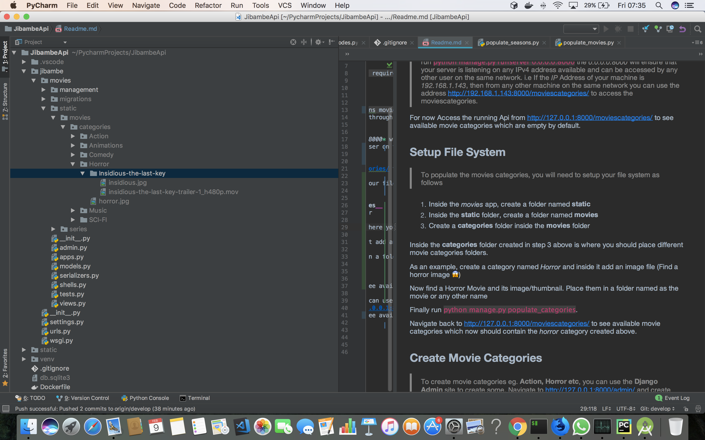

# Jibambex API
A Django Rest Framework that generates Movies url's from a local storage and serves them to clients.
## Getting Started
Create a virtual environment to work on by running `virtualenv venv -p python3`. Activate It through `source venv/bin/activate` and then
Clone the repo by running `git clone git@github.com:esirK/JibambexApi.git` .

## Prerequisites
Change into the __JibambeApi__ folder and run `pip install -r requirements.txt` which will install all the required packages.
Now You almost there.

## Installing

To get you database ready, run `python manage.py makemigrations movies` then `python manage.py migrate`. You will need
a super user account during development which you can create through `python manage.py createsuperuser` . Fill in detals asked and you are good to go.
### Start the server
> run `python manage.py runserver 0.0.0.0:8000` the *0.0.0.0:8000* will ensure that your server is listening on
any IPv4 address available and can be accessed by any other user on the same network. i.e If the *IP* Address of your machine is *192.168.1.143*, then from any other machine on the same network you can use the address http://192.168.1.143:8000/moviescategories/ to access the moviescategories.

For now
Access the running Api from http://127.0.0.1:8000/moviescategories/ to see available movie categories which are empty by default.
### Setup File System
> To populate the movies categories, you will need to setup your file system as follows

1. Inside the *movies* app, create a folder named __static__
2. Inside the __static__ folder, create a folder named __movies__
3. Create a __categories__ folder inside the __movies__ folder

Inside the __categories__ folder created in step 3 above is where you should place different movie categories folders.

As an example, create a category named *Horror*  and inside it add an image file (Find a horror image 😱)

Now find a Horror Movie and its image/thumbnail. Place them in a folder named as the movie or any other name

Finally run `python manage.py populate_categories && python manage.py collectstatic` .

Navigate back to http://127.0.0.1:8000/moviescategories/ to see available movie categories which now should contain the *horror* category created above.
### Django Admin
> You can use the __Django Admin__  site to play around with different models. Navigate to http://127.0.0.1:8000/admin/

To access movies in a single category, navigate to http://127.0.0.1:8000/moviescategories/{id} where *id* is the id of the Movies category

## Testing

## Authors
* **Isaiah Ngaruiya** - *Initial work*
